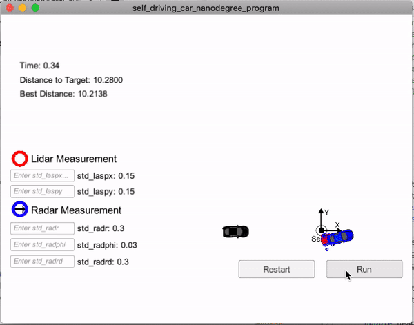
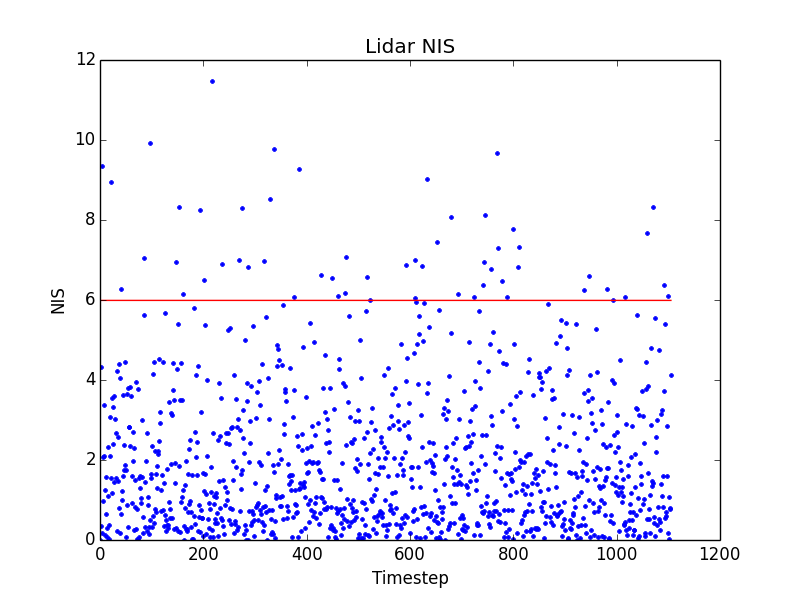

# Sensor fusion and prediction using Unscented Kalman Filter

## Overview

In this project, my goal is to write a software pipeline to intercept an escaped car driving in a circular path. The run away car is being sensed by a stationary sensor that can measure both Lidar and Radar data. To capture the run away car this pipeline will use Unscented Kalman Filters, Sensor Fusion and Kinematic Models to predict the position of the escaped car and guide an interceptor car to a position within 0.1 unit distance from it.

## Dependencies
* [Simulator](https://github.com/udacity/self-driving-car-sim/releases)
* [uWebSockets](https://github.com/uWebSockets/uWebSockets)
* cmake
* gcc/g++
* make
* openssl
* libuv
* zlib

## Build Instructions
1. Clone this repo.
2. Make a build directory: `mkdir build && cd $_`
3. Compile: `cmake .. && make`

## Run Instructions
* To run with simulator `./UnscentedKF`

## Fine tuning hyperparameters

The objective function we are trying to minimize is the RMSE of our predicted state (after the state update step) compared to the ground truth.

We can also check the consistency of our algorithm by using a metric called Normalized Innovation Squared (NIS) which is the difference between the predicted measurement and the actual measurement normalized in relation to the state covariance matrix.

These two metrics together can be used to fine tune the longitudinal and yaw acceleration noise parameters as well as a proper initialization of the state vector and state covariance matrix.

The charts below show that after fine tuning all these parameters we have modeled the longitudinal and yaw acceleration noise with 95% confidence.

